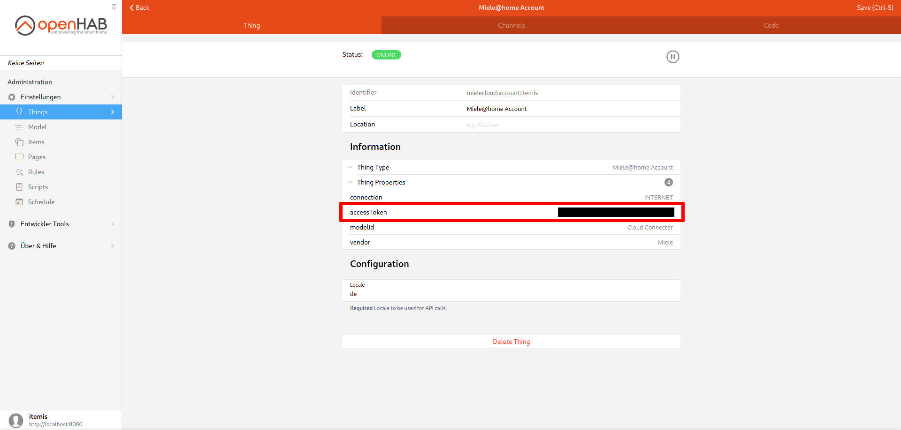

# Tutorial: Querying the cloud status

This tutorial gives a short overview of how to query the cloud status of Miele devices.

1. Obtain access token

    The access token is shown in the openHAB thing configuration of the Miele@Home Account thing in the section "Information" under "Thing Properties".
    Copy this token.

    **Warning**: The access token is comparable to a password for your Miele Cloud Account so it should be handled with the same care as a real password.
    Never share this token with others!

    

2. Authorize in the Miele 3rd Party Swagger

    Go to [https://www.miele.com/developer/swagger-ui/swagger.html](https://www.miele.com/developer/swagger-ui/swagger.html) and click "Authorize".

    

3. Authorize with your access token

    Paste your access token into the text field labelled "Value" in the "BearerAuth" section, then click "Authorize" and close the dialog.
    This will give the Miele 3rd Party Swagger the ability to access (and modify!) the state of your devices.

    

4. Query the cloud status

    Go to the expandable "GET /devices" section, open it and click "Try it out".

    

5. Execute the GET request

    Click "Execute".

    

6. Cloud status is shown

    Under "Responses" find "Server response".
    The response code should be 200 (OK) and the response body should be displayed.
    In the response body you find a list of your devices by internal identifier.

    
