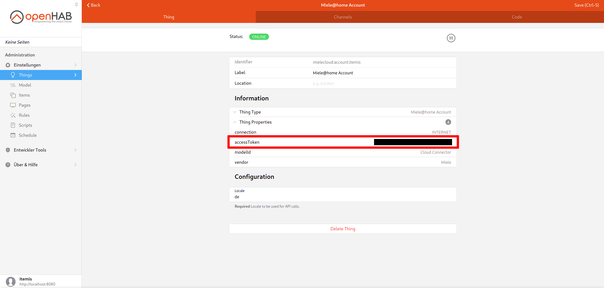

# Tutorial: Querying live updates from the cloud status

This tutorial gives a short overview of how to query the live updates from the Miele cloud.

1. Obtain access token

    The access token is shown in the openHAB thing configuration of the Miele@Home Account thing in the section "Information" under "Thing Properties".
    Copy this token.

    **Warning**: The access token is comparable to a password for your Miele Cloud Account so it should be handled with the same care as a real password.
    Never share this token with others!

    

2. Stream live updates

    The recommended method for streaming live updates is to use `curl` but any other tool that can query an SSE event stream will do.

    Run the following command in a terminal replacing `AccessToken` with the access token obtained in step 1:

    ```bash
    curl -H "Accept:text/event-stream" -H "Authorization: Bearer AccessToken" https://api.mcs3.miele.com/v1/devices/all/events
    ```

3. Events are streamed

    `curl` now displays all events that are sent from the cloud until you cancel it by hitting `Ctrl+C`.